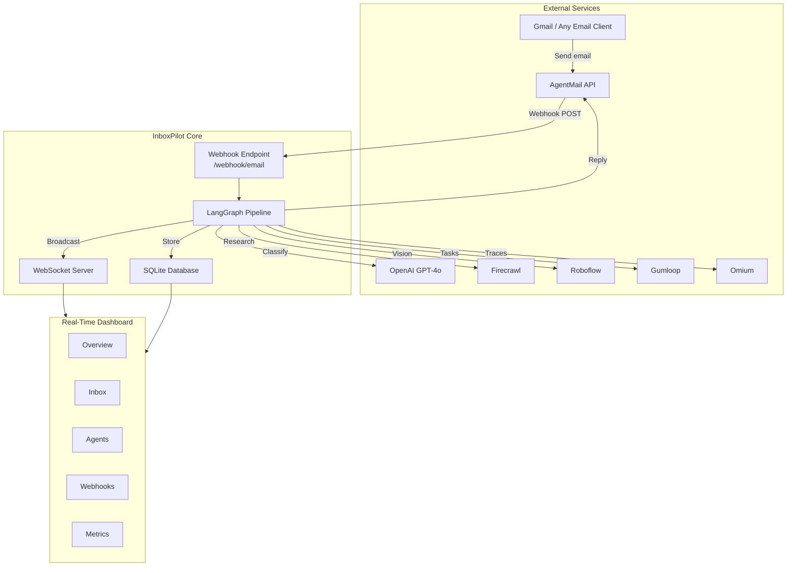
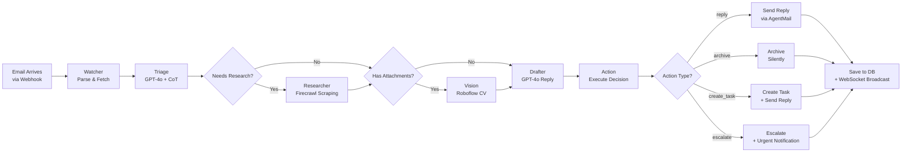
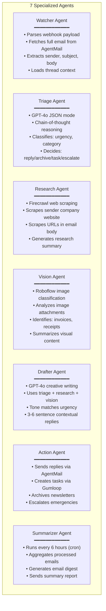

# InboxPilot — Autonomous Multi-Agent Email Operations

> **An end-to-end autonomous email pipeline that triages, researches, analyzes attachments, drafts replies, and takes action — with zero human intervention.**

InboxPilot is a production-grade autonomous system built on **LangGraph** that processes real emails through a 7-agent pipeline. It receives emails via webhooks, classifies them with GPT-4o chain-of-thought reasoning, researches unknown senders, analyzes image attachments, drafts contextual replies, and executes actions — all autonomously.

---

## System Architecture



---

## Pipeline Workflow

Every email goes through this autonomous pipeline:



---

## Agent Details



---

## Tech Stack

| Layer | Technology | Purpose |
|-------|-----------|---------|
| **Agent Framework** | LangGraph | Stateful multi-agent orchestration with conditional routing |
| **LLM** | OpenAI GPT-4o | Classification (JSON mode), drafting, summarization |
| **Backend** | FastAPI + Uvicorn | Async HTTP server, webhook receiver, REST API |
| **Email** | AgentMail | Inbox management, send/receive, webhooks |
| **Web Scraping** | Firecrawl | Sender research, URL content extraction |
| **Computer Vision** | Roboflow | Image attachment classification |
| **Task Automation** | Gumloop | External task creation and workflow triggers |
| **Observability** | Omium SDK | Auto-traced LangGraph pipeline, per-agent spans |
| **Database** | SQLite | Persistent storage for processed emails |
| **Real-Time** | WebSocket | Live dashboard updates |
| **Dashboard** | Vanilla HTML/CSS/JS | 5-tab monitoring interface |

---

## Quickstart (Clean Machine → Green Demo in 5 Minutes)

### Prerequisites

- Python 3.11+
- ngrok (`brew install ngrok` on macOS)
- API keys for: AgentMail, OpenAI, Firecrawl, Roboflow

### Step 1: Clone & Setup

```bash
git clone https://github.com/dhiraj-143r/srish_dhi.git
cd srish_dhi/inbox-pilot

# Create virtual environment
python3 -m venv venv
source venv/bin/activate # macOS/Linux
# venv\Scripts\activate  # Windows

# Install dependencies
pip install -r requirements.txt
```

### Step 2: Configure Environment

```bash
cp .env.example .env
```

Edit `.env` with your API keys:

```env
AGENTMAIL_API_KEY=am_your_key_here
FIRECRAWL_API_KEY=fc-your_key_here
ROBOFLOW_API_KEY=your_key_here
ROBOFLOW_PUBLISHABLE_KEY=rf_your_key_here
OPENAI_API_KEY=sk-your_key_here
GUMLOOP_API_KEY=     # Optional
GUMLOOP_USER_ID=     # Optional
OMIUM_API_KEY=omium_your_key_here # Optional (bonus tracing)
```

### Step 3: Start the Tunnel

```bash
# In a separate terminal
ngrok http 8000
```

Copy the HTTPS URL (e.g., `https://abc123.ngrok-free.dev`)

### Step 4: Launch InboxPilot

```bash
python main.py
```

You should see:

```
 InboxPilot starting up...
 Database initialized
 Omium tracing initialized (LangGraph auto-instrumented)
 Agent inbox: yourname@agentmail.to
 Dashboard: http://localhost:8000
```

### Step 5: Register Webhook

```bash
curl -X POST http://localhost:8000/api/webhook/register \
 -H "Content-Type: application/json" \
 -d '{"url": "https://YOUR-NGROK-URL/webhook/email"}'
```

### Step 6: Send a Test Email

Send an email to the inbox address shown in the startup logs (e.g., `yourname@agentmail.to`).

**Watch it process autonomously in the dashboard at `http://localhost:8000`** 

---

## Dashboard

The real-time monitoring dashboard has 5 tabs:

| Tab | What it shows |
|-----|---------------|
| **Overview** | Email activity chart (24h/7d/30d), Unified Inbox feed, stats counters, resource status |
| **Inbox** | Full email table with sender, subject, urgency, action, status, timestamp. Click any row for AI reasoning |
| **Agents** | Status cards for all 7 agents with health indicators |
| **Webhooks** | Webhook setup guide, registered endpoints, event history |
| **Metrics** | Processing breakdown by action type, urgency distribution, tool integration status |

### Key Features

- **Auto-refresh**: Stats and email table update every 10 seconds
- **WebSocket**: Real-time notifications when new emails are processed
- **Persistent Feed**: Unified Inbox loads from database, survives page refresh
- **Correct Timestamps**: Each email shows its actual arrival time
- **Reasoning Modal**: Click any email to see the full AI chain-of-thought reasoning

---

## Project Structure

```
inbox-pilot/
├── main.py     # FastAPI app, webhook handler, API routes
├── config.py    # Centralized configuration from .env
├── requirements.txt   # Python dependencies
├── .env.example    # Environment template
│
├── agents/     # LangGraph agent implementations
│ ├── graph.py    # StateGraph pipeline definition
│ ├── state.py    # Typed EmailState schema
│ ├── watcher.py   # Email parser agent
│ ├── triage.py   # GPT-4o classifier agent
│ ├── researcher.py  # Firecrawl research agent
│ ├── vision.py   # Roboflow vision agent
│ ├── drafter.py   # GPT-4o reply drafter
│ ├── action.py   # Action executor agent
│ └── summarizer.py  # Cron-based digest agent
│
├── tools/     # External tool integrations
│ ├── agentmail_tools.py # AgentMail SDK wrapper
│ ├── firecrawl_tools.py # Firecrawl web scraping
│ ├── roboflow_tools.py # Roboflow computer vision
│ └── gumloop_tools.py  # Gumloop task automation
│
├── database/    # Database layer
│ └── db.py    # SQLite schema, CRUD operations
│
└── dashboard/    # Frontend
 ├── index.html   # Single-page app (5 tabs)
 ├── styles.css   # Dark theme UI styles
 └── app.js    # Charts, WebSocket, auto-refresh
```

---

## API Endpoints

| Method | Endpoint | Description |
|--------|----------|-------------|
| `POST` | `/webhook/email` | AgentMail webhook receiver |
| `GET` | `/api/emails` | List all processed emails |
| `GET` | `/api/stats` | Dashboard statistics |
| `GET` | `/api/email/{id}/agents` | Agent logs for specific email |
| `POST` | `/api/webhook/register` | Register webhook URL with AgentMail |
| `POST` | `/api/digest/trigger` | Manually trigger email digest |
| `GET` | `/health` | Health check for all integrations |
| `WS` | `/ws` | WebSocket for real-time updates |

---

## Omium Observability (Bonus)

When `OMIUM_API_KEY` is set, InboxPilot automatically:

- Initializes `omium.init()` with `auto_trace=True`
- Calls `omium.instrument_langgraph()` for automatic pipeline tracing
- Applies `@omium.trace` decorators to all 6 agent functions
- Assigns unique `execution_id` per email for trace correlation

View traces at [app.omium.ai](https://app.omium.ai) → **inbox-pilot** project.

```
 pipeline.ainvoke()
 ├── watcher_agent → Parse email
 ├── triage_agent  → Classify with GPT-4o
 ├── researcher_agent → Web scraping (conditional)
 ├── vision_agent  → Attachment analysis (conditional)
 ├── drafter_agent → Generate reply
 └── action_agent  → Execute action
```

---

## Test Emails

Send these to your agent inbox to test different action types:

**→ Reply (urgent):**
```
Subject: URGENT: Client demo broken - need fix before 9 AM
Body: The staging environment crashed during the client presentation. CSS is broken across all pages. Can you fix this before the 9 AM demo tomorrow?
```

**→ Archive (newsletter):**
```
Subject: Weekly Dev Digest - Top GitHub Repos This Week
Body: Here are this week's trending repositories on GitHub...
```

**→ Create Task:**
```
Subject: Urgent: Project deadline moved to Friday
Body: The client just called — they need the MVP delivered by Friday instead of next Wednesday. Please reprioritize the sprint backlog.
```

**→ Escalate (emergency):**
```
Subject: CRITICAL: Data breach detected - immediate action required
Body: Our security team detected unauthorized access to the customer database. Approximately 50,000 records may be affected. We need legal, security, and engineering leads in an emergency call within 30 minutes.
```

---

## License

MIT
